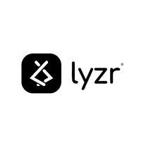

{width=120}

# 🎯 Culture Fit Assessment Platform

**AI-Powered Workplace Culture Matching**  
Discover where you truly belong with advanced AI analysis

---


---

## 🌟 Overview

The **Culture Fit Assessment Platform** revolutionizes how professionals find their ideal workplace environment. Using advanced AI technology, our platform analyzes your unique workplace personality and matches you with roles, teams, and companies that align with your cultural DNA.

### ✨ Key Features

- 🤖 **AI-Powered Analysis** — Multiple AI agents work simultaneously to analyze your responses  
- 🎯 **Precise Matching** — 95% accuracy in cultural compatibility predictions  
- 📊 **Comprehensive Reports** — Detailed insights into your workplace archetype  
- 👥 **Team Compatibility** — Understand how you work with different personality types  
- 💼 **Role Recommendations** — Discover positions that match your cultural preferences  
- 📧 **Instant Results** — Get your assessment results via email with PDF reports  
- 🖨️ **Professional Reports** — Print-ready summaries for HR teams  

---

## 🚀 How It Works

```mermaid
graph LR
    A[📝 Take Assessment] --> B[🤖 AI Processing]
    B --> C[📊 Get Results]
    C --> D[🎯 Find Perfect Match]
    
    style A fill:#e3f2fd
    style B fill:#f3e5f5
    style C fill:#e8f5e8
    style D fill:#fff3e0

## 🚀 How It Works

- 📋 **Complete Assessment** — Answer questions about your work style, preferences, and values  
- ⚡ **AI Analysis** — Our AI agents analyze your responses in real-time  
- 📈 **Receive Insights** — Get detailed reports on your workplace archetype  
- 🎯 **Discover Matches** — Find roles and teams that align with your culture fit

---

## 🏗️ Architecture

### Frontend
- **Next.js 14** — App Router for optimal performance  
- **React 19** — Modern hooks and components  
- **TypeScript** — Type-safe development  
- **Tailwind CSS v4** — Responsive design  
- **shadcn/ui** — Consistent component library

### AI Integration
- **Lyzr AI Agents** — Intelligent assessment processing  
- **Real-time Analysis** — Multiple specialized agents working in parallel  
- **Perplexity API** — Job market insights and context enrichment

### Features
- 📱 **Responsive Design** — Works seamlessly on all devices  
- 🌙 **Dark Mode Support** — Toggle between light and dark themes  
- 📧 **Email Integration** — Automated result delivery  
- 🔒 **Secure Processing** — Privacy-focused data handling

---

## 🛠️ Installation

### Prerequisites
- Node.js 18+  
- npm or yarn package manager

### Quick Start

```bash
# Clone the repository
git clone <repository-url>
cd culture-fit-assessment

# Install dependencies
npm install

# Set up environment variables
cp .env.example .env.local

# Run the development server
npm run dev

Open [http://localhost:3000](http://localhost:3000) to view the application.

---

## 📁 Project Structure

```text
├── app/                    # Next.js App Router
│   ├── assessment/         # Assessment flow
│   ├── processing/         # AI processing page
│   ├── results/            # Results display
│   ├── hr-dashboard/       # HR management
│   └── api/                # API endpoints
├── components/             # Reusable UI components
│   └── ui/                 # shadcn/ui components
├── data/                   # Static data and configurations
├── services/               # External service integrations
├── types/                  # TypeScript type definitions
└── utils/                  # Utility functions

## 🤝 Contributing

We welcome contributions! Please submit a Pull Request. For major changes, open an issue first to discuss what you would like to change.

---

## 📄 License

This project is licensed under the MIT License — see the [LICENSE](LICENSE) file for details.

---

## 🙏 Acknowledgments

- **Lyzr AI** — for providing the intelligent assessment technology  
- **Vercel** — for hosting and deployment platform  
- **shadcn/ui** — for the beautiful component library  

---

## 🚀 Developed by

**Nirupam Thapa**  
_Product Fellow at Lyzr AI_  

*Transforming workplace culture matching through AI innovation*


